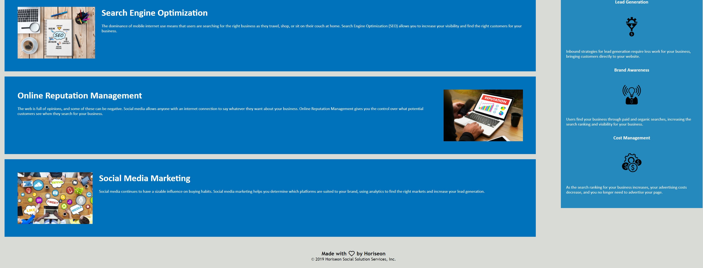

# Horiseon Refactoring Project

Horiseon is a company dedicated to
- Search Engine Optimization
- Online Reputation Management
- Social Media Marketing

This website briefly describes each topic with their statements. Each section is seperated using div tags 
and need proper semantics and updated CSS file to help with website accessibility.

## Contents

This project includes an updated Index.html file, Assets folder containing updated CSS and Images used to build webpage
as well as screenshots of deployed website.

### Changes in the HTML & CSS

Changes have been made in the HTML and CSS to provide greater accessibility.
`` 
 
 `` tags were removed for the proper semantics and the CSS was changed where appropriate.
Code in the HTML and CSS was reviewed and corrected where there were mistakes as well.

Listed changes are below:
- Adding Semantics to remove div tags in HTML
- Changed all Calibri font family to include
- Changed to header instead of div class
- Swapped div class to header
- Added nav tags in HTML
- Changed to target nav instead of a div tag
- Changing div classes to sections and articles with proper ids
- Alt tag for img in HTML
- Added a title to hero image in HTML
- Used correct selector to target proper id
- Consolidated styling where appropriate
- Changed to target footer, changed div section to footer in HTML

#### URL to deployed Site

https://cleetidwell.github.io/Horiseon/

Refactoring done by @CLeeTidwell on Github

<footer>

© 2019 Horiseon Social Solution Services, Inc.

</footer>